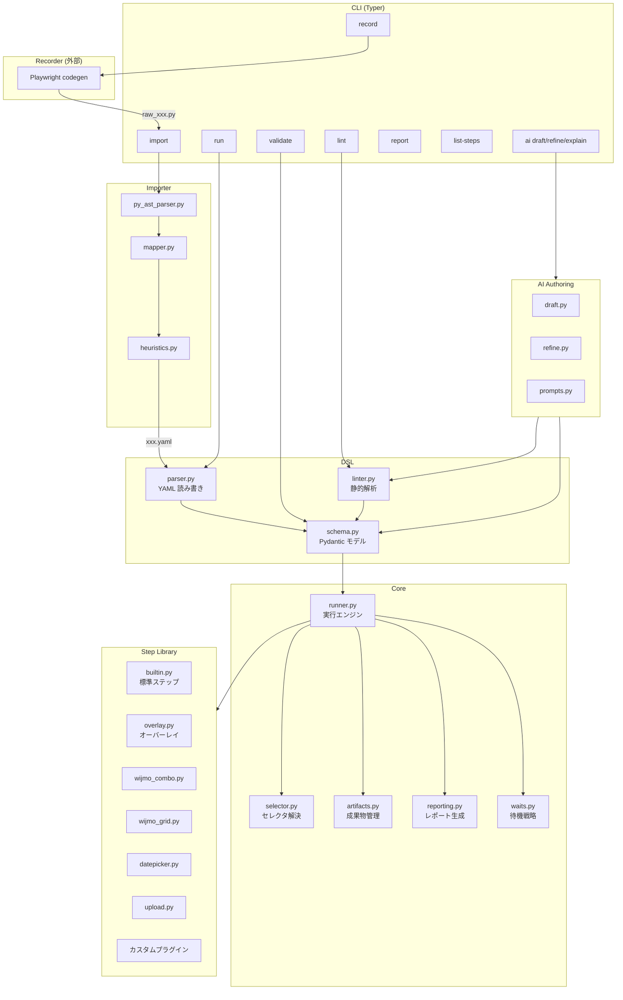
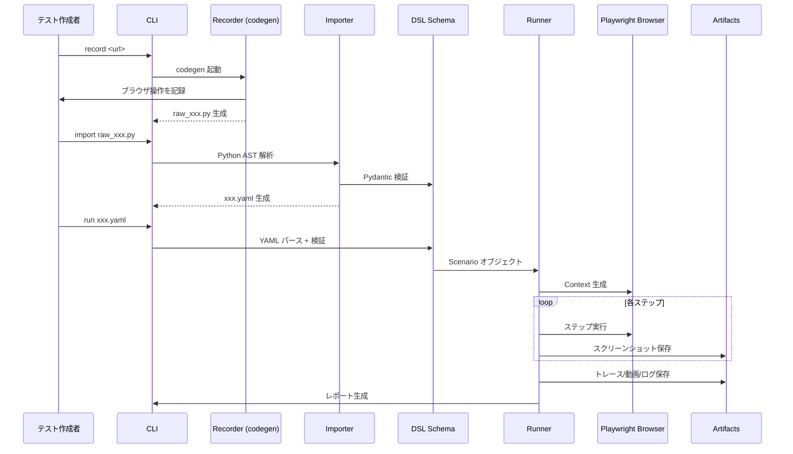
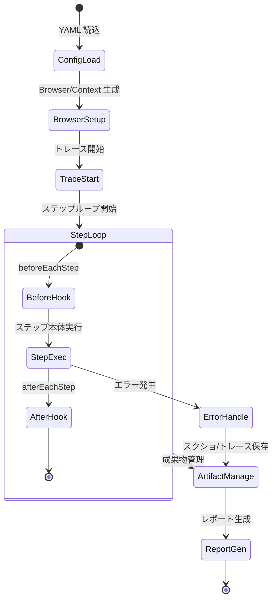
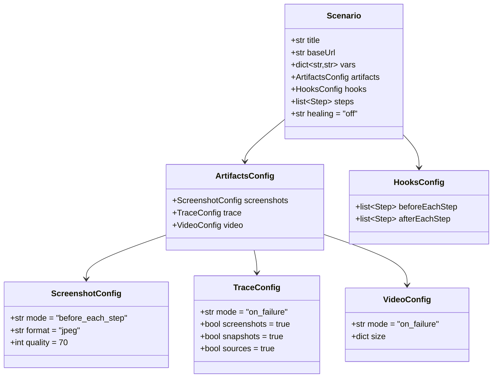
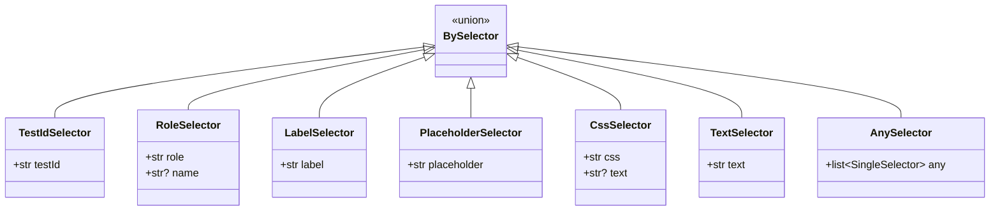
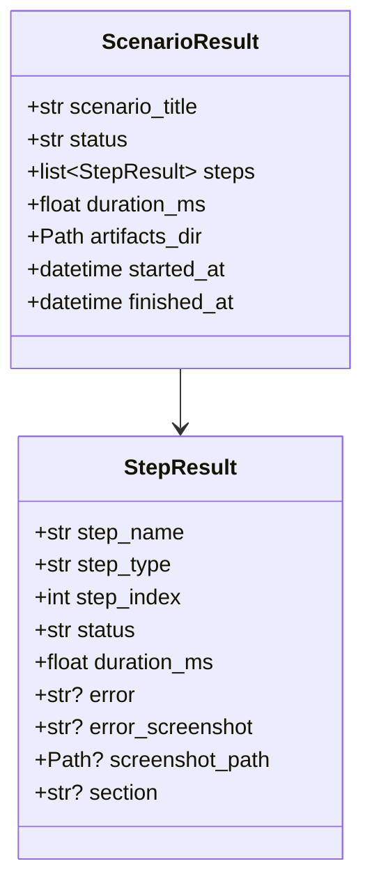
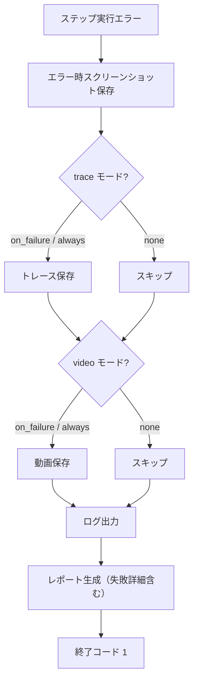

# 設計書: ブラウザ操作 Record/Replay テストツール

## 概要（Overview）

本設計書は、Python + Playwright codegen を基盤としたブラウザ操作 Record/Replay テストツールの技術設計を定義する。

本ツールは以下の5つのコアコンポーネントで構成される：

1. **Recorder** — Playwright codegen を利用したブラウザ操作の記録（外部依存）
2. **Importer** — Python AST 解析による codegen 出力から YAML DSL への変換
3. **Runner** — YAML DSL の読み込みと Playwright による自動実行
4. **Step Library** — 標準ステップ + 高レベルステップ（Wijmo/Overlay 等）
5. **AI Authoring** — 自然言語からの YAML DSL 生成・整形・説明

主な設計方針：
- Angular SPA を主要対象とし、JS 生成 UI（オーバーレイ、Wijmo）での安定動作を最優先
- YAML DSL は「人間が読める」「手書きで編集できる」「全体の流れが把握できる」ことを重視
- Pydantic によるスキーマ駆動の検証で型安全性を確保
- プラグイン方式によるカスタムステップの拡張性を提供

### 技術スタック

| カテゴリ | ライブラリ | 用途 |
|---------|-----------|------|
| ブラウザ自動化 | Playwright (Python) | 記録・実行・トレース |
| DSL スキーマ | Pydantic v2 | YAML DSL の型定義・検証 |
| YAML 処理 | ruamel.yaml | コメント保持・整形付き YAML 読み書き |
| CLI | Typer | コマンドラインインターフェース |
| レポート | Jinja2 | HTML レポートテンプレート |
| テスト | pytest + hypothesis | ユニットテスト + プロパティベーステスト |

---

## アーキテクチャ（Architecture）

### 全体構成図



### データフロー



### Runner 実行ライフサイクル



---

## コンポーネントとインターフェース（Components and Interfaces）

### 1. DSL Schema (`dsl/schema.py`)

Pydantic v2 モデルによる YAML DSL の型定義。全コンポーネントの共通言語となる。

```python
from pydantic import BaseModel, Field
from typing import Literal, Optional, Union
from enum import Enum

# --- セレクタ定義 ---
class TestIdSelector(BaseModel):
    testId: str

class RoleSelector(BaseModel):
    role: str
    name: Optional[str] = None

class LabelSelector(BaseModel):
    label: str

class PlaceholderSelector(BaseModel):
    placeholder: str

class CssSelector(BaseModel):
    css: str
    text: Optional[str] = None  # 補助条件

class TextSelector(BaseModel):
    text: str

class AnySelector(BaseModel):
    any: list[Union[TestIdSelector, RoleSelector, LabelSelector,
                    PlaceholderSelector, CssSelector, TextSelector]]

BySelector = Union[TestIdSelector, RoleSelector, LabelSelector,
                   PlaceholderSelector, CssSelector, TextSelector, AnySelector]

# --- ステップ定義（代表例） ---
class GotoStep(BaseModel):
    goto: dict  # url, name
    
class ClickStep(BaseModel):
    click: dict  # by, name, strict

class FillStep(BaseModel):
    fill: dict  # by, value, name, secret

# ... 他のステップ型

# --- シナリオ定義 ---
class ScreenshotConfig(BaseModel):
    mode: Literal["before_each_step", "before_and_after", "none"] = "before_each_step"
    format: Literal["jpeg", "png"] = "jpeg"
    quality: int = Field(default=70, ge=1, le=100)

class TraceConfig(BaseModel):
    mode: Literal["on_failure", "always", "none"] = "on_failure"

class VideoConfig(BaseModel):
    mode: Literal["on_failure", "always", "none"] = "on_failure"

class ArtifactsConfig(BaseModel):
    screenshots: ScreenshotConfig = ScreenshotConfig()
    trace: TraceConfig = TraceConfig()
    video: VideoConfig = VideoConfig()

class Scenario(BaseModel):
    title: str
    baseUrl: str
    vars: dict[str, str] = {}
    artifacts: ArtifactsConfig = ArtifactsConfig()
    hooks: dict = {}
    steps: list[dict]  # Union of step types
    healing: Literal["off", "safe"] = "off"
```

### 2. DSL Parser (`dsl/parser.py`)

ruamel.yaml を使用した YAML の読み書き。コメント保持と整形を担当。

```python
class DslParser:
    """YAML DSL の読み込み・書き出し・検証を担当"""
    
    def load(self, path: Path) -> Scenario:
        """YAML ファイルを読み込み、Pydantic モデルに変換"""
        ...
    
    def dump(self, scenario: Scenario, path: Path) -> None:
        """Pydantic モデルを YAML ファイルに書き出し（コメント保持）"""
        ...
    
    def validate(self, path: Path) -> list[ValidationError]:
        """YAML ファイルのスキーマ検証"""
        ...
```

### 3. DSL Linter (`dsl/linter.py`)

YAML DSL の静的解析。セレクタ危険度やアンチパターンを検出。

```python
class LintSeverity(Enum):
    ERROR = "error"
    WARNING = "warning"
    INFO = "info"

@dataclass
class LintIssue:
    step_name: str
    line_number: int
    severity: LintSeverity
    rule: str
    message: str

class DslLinter:
    """YAML DSL の静的解析"""
    
    def lint(self, scenario: Scenario) -> list[LintIssue]:
        """全 lint ルールを適用し、問題を検出"""
        ...
    
    def _check_text_only_selector(self, step) -> Optional[LintIssue]:
        """text 単体セレクタの警告"""
        ...
    
    def _check_missing_any_fallback(self, step) -> Optional[LintIssue]:
        """any フォールバック未設定の情報通知"""
        ...
    
    def _check_missing_secret(self, step) -> Optional[LintIssue]:
        """パスワード系フィールドの secret 未設定警告"""
        ...
```

### 4. Selector Resolver (`core/selector.py`)

セレクタの解決ロジック。strict モードと any フォールバックを実装。

```python
class SelectorResolver:
    """By セレクタを Playwright Locator に変換・解決"""
    
    def resolve(self, page: Page, by: BySelector) -> Locator:
        """セレクタを解決し、Playwright Locator を返す"""
        ...
    
    def _resolve_single(self, page: Page, selector: SingleSelector) -> Locator:
        """単一セレクタの解決"""
        ...
    
    def _resolve_any(self, page: Page, candidates: list[SingleSelector]) -> Locator:
        """any フォールバック: 上から順に試行し、visible かつ strict を満たすものを返す"""
        ...
    
    def _try_healing(self, page: Page, original: BySelector) -> Optional[Locator]:
        """safe モード時のセレクタ自己修復"""
        ...
```

### 5. Runner (`core/runner.py`)

YAML DSL の実行エンジン。ライフサイクル管理とステップディスパッチを担当。

```python
class RunnerConfig:
    headed: bool = False
    workers: int = 1
    
class StepResult:
    step_name: str
    status: Literal["passed", "failed", "skipped"]
    duration_ms: float
    error: Optional[str] = None
    screenshot_path: Optional[Path] = None

class ScenarioResult:
    scenario_title: str
    status: Literal["passed", "failed"]
    steps: list[StepResult]
    duration_ms: float
    artifacts_dir: Path

class Runner:
    """YAML DSL 実行エンジン"""
    
    async def run(self, scenario: Scenario, config: RunnerConfig) -> ScenarioResult:
        """シナリオを実行し、結果を返す"""
        ...
    
    async def _setup_context(self, scenario: Scenario) -> BrowserContext:
        """Browser/Context の生成と環境設定"""
        ...
    
    async def _execute_step(self, page: Page, step: dict) -> StepResult:
        """単一ステップの実行（フック含む）"""
        ...
    
    async def _dispatch_step(self, page: Page, step: dict) -> None:
        """ステップ種別に応じたハンドラへのディスパッチ"""
        ...
```

### 6. Step Library (`steps/`)

ステップハンドラのプラグインアーキテクチャ。

```python
# --- ステップレジストリ ---
class StepRegistry:
    """ステップハンドラの登録・検索"""
    _handlers: dict[str, StepHandler] = {}
    
    def register(self, name: str, handler: StepHandler) -> None:
        """ステップハンドラを登録"""
        ...
    
    def get(self, name: str) -> StepHandler:
        """名前でハンドラを取得"""
        ...
    
    def list_all(self) -> list[StepInfo]:
        """登録済み全ステップの情報を返す"""
        ...

# --- ステップハンドラインターフェース ---
class StepHandler(Protocol):
    async def execute(self, page: Page, params: dict, context: StepContext) -> None:
        """ステップを実行"""
        ...
    
    def get_schema(self) -> type[BaseModel]:
        """パラメータの Pydantic スキーマを返す"""
        ...
```

### 7. Importer (`importer/`)

Python AST 解析による codegen 出力の YAML DSL 変換。

```python
class ImporterConfig:
    with_expects: bool = False  # expectVisible 補助挿入

class PyAstParser:
    """Python AST を解析し、中間表現を生成"""
    
    def parse(self, source: str) -> list[RawAction]:
        """Python ソースコードを解析"""
        ...

class Mapper:
    """中間表現を YAML DSL ステップに変換"""
    
    def map_actions(self, actions: list[RawAction]) -> list[dict]:
        """RawAction リストを DSL ステップリストに変換"""
        ...

class Heuristics:
    """セクション生成・命名・secret 検出のヒューリスティック"""
    
    def auto_section(self, steps: list[dict]) -> list[dict]:
        """連続する類似操作をセクションにグループ化"""
        ...
    
    def auto_name(self, step: dict) -> str:
        """動詞-目的語形式のステップ名を自動生成"""
        ...
    
    def detect_secret(self, step: dict) -> bool:
        """パスワード関連フィールドの検出"""
        ...
```

### 8. Artifacts Manager (`core/artifacts.py`)

成果物のライフサイクル管理。

```python
class ArtifactsManager:
    """テスト実行成果物の管理"""
    
    def __init__(self, base_dir: Path, config: ArtifactsConfig):
        ...
    
    def create_run_dir(self) -> Path:
        """run-YYYYMMDD-HHMMSS ディレクトリを作成"""
        ...
    
    async def save_screenshot(self, page: Page, step_index: int, step_name: str) -> Path:
        """スクリーンショットを保存"""
        ...
    
    async def save_trace(self, context: BrowserContext) -> Path:
        """トレースを保存"""
        ...
    
    def save_flow_copy(self, scenario: Scenario) -> Path:
        """実行に使用した YAML DSL のコピーを保存"""
        ...
    
    def save_env_info(self, scenario: Scenario) -> Path:
        """実行環境情報（秘密値マスク済み）を保存"""
        ...
    
    def cleanup_on_success(self) -> None:
        """成功時に on_failure 成果物を削除"""
        ...
```

### 9. Reporting (`core/reporting.py`)

複数形式のレポート生成。

```python
class Reporter:
    """テスト結果レポートの生成"""
    
    def generate_json(self, result: ScenarioResult) -> Path:
        """JSON レポートを生成"""
        ...
    
    def generate_html(self, result: ScenarioResult) -> Path:
        """HTML レポートを生成（Jinja2 テンプレート使用）"""
        ...
    
    def generate_junit_xml(self, result: ScenarioResult) -> Path:
        """JUnit XML レポートを生成（CI 統合用）"""
        ...
```

### 10. AI Authoring (`ai/`)

自然言語からの YAML DSL 生成・整形。

```python
class AiDrafter:
    """自然言語仕様から YAML DSL を生成"""
    
    def draft(self, spec_text: str) -> Scenario:
        ...

class AiRefiner:
    """import 後の YAML DSL を整形・改善"""
    
    def refine(self, scenario: Scenario) -> Scenario:
        ...

class AiExplainer:
    """YAML DSL からアウトラインを生成"""
    
    def explain(self, scenario: Scenario) -> str:
        ...
```


---

## データモデル（Data Models）

### 1. YAML DSL スキーマ（完全定義）



### 2. By セレクタモデル



### 3. ステップモデル（全種別）

#### 標準ステップ

| カテゴリ | ステップ名 | 主要パラメータ |
|---------|-----------|--------------|
| ナビゲーション | `goto` | `url`, `name` |
| ナビゲーション | `back` | `name` |
| ナビゲーション | `reload` | `name` |
| 操作 | `click` | `by`, `name`, `strict` |
| 操作 | `dblclick` | `by`, `name`, `strict` |
| 操作 | `fill` | `by`, `value`, `name`, `secret` |
| 操作 | `press` | `by`, `key`, `name` |
| 操作 | `check` | `by`, `name` |
| 操作 | `uncheck` | `by`, `name` |
| 操作 | `selectOption` | `by`, `value`, `name` |
| 待機 | `waitFor` | `by`, `state`, `timeout`, `name` |
| 待機 | `waitForVisible` | `by`, `timeout`, `name` |
| 待機 | `waitForHidden` | `by`, `timeout`, `name` |
| 待機 | `waitForNetworkIdle` | `timeout`, `name` |
| 検証 | `expectVisible` | `by`, `name` |
| 検証 | `expectHidden` | `by`, `name` |
| 検証 | `expectText` | `by`, `text`, `name` |
| 検証 | `expectUrl` | `url`, `name` |
| 取得 | `storeText` | `by`, `varName`, `name` |
| 取得 | `storeAttr` | `by`, `attr`, `varName`, `name` |
| デバッグ | `screenshot` | `name` |
| デバッグ | `log` | `message`, `name` |
| デバッグ | `dumpDom` | `by`, `name` |
| セッション | `useStorageState` | `path`, `name` |
| セッション | `saveStorageState` | `path`, `name` |

#### 高レベルステップ

| ステップ名 | 主要パラメータ | 対象 UI |
|-----------|--------------|---------|
| `selectOverlayOption` | `open`, `list`, `optionText`, `name` | Angular Material / 汎用オーバーレイ |
| `selectWijmoCombo` | `root`, `optionText`, `name` | Wijmo ComboBox |
| `clickWijmoGridCell` | `grid`, `rowKey`, `column`, `name` | Wijmo FlexGrid |
| `setDatePicker` | `by`, `date`, `format`, `name` | 日付ピッカー全般 |
| `uploadFile` | `by`, `filePath`, `name` | ファイルアップロード |
| `waitForToast` | `text`, `timeout`, `name` | トースト通知 |
| `assertNoConsoleError` | `name` | ブラウザコンソール |
| `apiMock` | `url`, `method`, `response`, `name` | API モック |
| `routeStub` | `url`, `handler`, `name` | API スタブ |

### 4. 実行結果モデル



### 5. Importer 中間表現

```python
@dataclass
class RawAction:
    """Python AST から抽出された操作の中間表現"""
    action_type: str          # "goto", "click", "fill", "expect" 等
    locator_chain: list[str]  # ["get_by_role", "textbox", "name=Email"]
    args: dict                # {"url": "...", "value": "..." }
    line_number: int          # 元の Python スクリプトの行番号
```

### 6. 変数展開

変数展開は以下の2種類をサポートする：

| 構文 | 説明 | 例 |
|------|------|-----|
| `${env.X}` | 環境変数参照 | `${env.EMAIL}` → `os.environ["EMAIL"]` |
| `${vars.X}` | シナリオ変数参照 | `${vars.email}` → `scenario.vars["email"]` |

変数展開はステップ実行時に遅延評価される。`storeText` / `storeAttr` で取得した値は `vars` に格納され、後続ステップで `${vars.X}` として参照可能。

### 7. アーティファクトディレクトリ構造

```
artifacts/
  run-YYYYMMDD-HHMMSS/
    flow.yaml              # 実行に使用した YAML DSL のコピー
    env.json               # 実行環境情報（秘密値マスク済み）
    report.json            # JSON レポート
    report.html            # HTML レポート
    junit.xml              # JUnit XML レポート
    screenshots/
      0001_before-fill-email.jpg
      0002_before-fill-password.jpg
      ...
    trace/
      trace.zip            # 失敗時のみ（on_failure モード）
    video/
      <auto>.webm          # 失敗時のみ（on_failure モード）
    logs/
      runner.log           # 実行ログ
      console.log          # ブラウザコンソールログ
```


---

## 正確性特性（Correctness Properties）

*正確性特性（property）とは、システムの全ての有効な実行において成立すべき特性・振る舞いのことである。人間が読める仕様と、機械で検証可能な正しさの保証を橋渡しする形式的な記述である。*

### Property 1: YAML DSL パース-出力ラウンドトリップ

*任意の*有効な Scenario オブジェクトに対して、YAML に出力（dump）してから再度パース（load）した結果は、元の Scenario オブジェクトと意味的に等価である。

**Validates: Requirements 3.8**

### Property 2: Importer AST マッピングの正確性

*任意の*有効な Playwright Python AST パターン（`page.goto(url)`, `page.get_by_role(role, name).click()`, `page.get_by_test_id(id).click()`, `page.locator(css).fill(value)`, `expect(...)` 等）に対して、Importer が生成する DSL ステップは、元の Python コードと同等の操作を表現する正しいステップ種別・セレクタ・パラメータを持つ。

**Validates: Requirements 2.1, 2.2, 2.3, 2.4, 2.5, 2.6**

### Property 3: Importer ステップ名の自動付与

*任意の*有効な Python スクリプトから変換されたステップに対して、Importer が自動付与する `name` は空文字列でなく、ASCII 英数字とハイフンで構成された動詞-目的語形式の文字列である。

**Validates: Requirements 2.7**

### Property 4: locator 文字列の正規化の冪等性

*任意の* locator 文字列に対して、正規化関数を1回適用した結果と2回適用した結果は同一である（冪等性）。また、`css=` プレフィックスの有無に関わらず、同じ要素を指す locator は同一の正規化結果を返す。

**Validates: Requirements 2.9**

### Property 5: パスワードフィールドの secret 自動検出

*任意の*フィールド名・role・name に "password"、"Password"、"パスワード"、"secret"、"token" 等のパスワード関連キーワードを含むステップに対して、Importer は `secret: true` を付与する。

**Validates: Requirements 2.10**

### Property 6: Pydantic スキーマ検証の完全性

*任意の*有効な YAML DSL ファイルに対して、Pydantic スキーマ検証は成功する。また、*任意の*必須フィールド（title, baseUrl, steps）が欠落した YAML に対して、検証はエラーを報告する。

**Validates: Requirements 3.1, 3.4, 3.5, 3.7**

### Property 7: 変数展開の正確性

*任意の*変数名 X と値 V に対して、`${env.X}` は環境変数 X の値に展開され、`${vars.X}` はシナリオ変数 X の値に展開される。展開後の文字列に未解決の変数参照パターンが残らない。

**Validates: Requirements 3.2**

### Property 8: 秘密値のマスク保証

*任意の* `secret: true` が付与されたステップの値に対して、ログ出力、JSON レポート、HTML レポート、env.json のいずれにも平文の秘密値が含まれない。

**Validates: Requirements 3.3, 8.9**

### Property 9: By セレクタの Playwright Locator 変換

*任意の*有効な BySelector（testId, role+name, label, placeholder, css, text, any）に対して、SelectorResolver は対応する Playwright Locator メソッド呼び出しを生成する。セレクタ種別と Locator メソッドの対応は一対一である。

**Validates: Requirements 4.1**

### Property 10: strict モードのデフォルト有効化

*任意の*明示的に `strict` を指定していないステップに対して、セレクタ解決は `strict: true` をデフォルトとして動作する。

**Validates: Requirements 4.2, 13.4**

### Property 11: any フォールバックの順序保証

*任意の* any セレクタの候補リスト [c1, c2, ..., cn] に対して、Runner は c1 から順に試行し、最初に visible かつ strict（1件一致）を満たした候補を採用する。ci が条件を満たす場合、ci+1 以降は試行されない。

**Validates: Requirements 4.3**

### Property 12: any フォールバック全候補失敗時のエラー情報

*任意の* any セレクタで全候補が条件を満たさなかった場合、エラーメッセージには試行した全候補のセレクタ情報と各候補の失敗理由が含まれる。

**Validates: Requirements 4.4**

### Property 13: Lint ルールの検出網羅性

*任意の* YAML DSL に対して、Linter は以下の全パターンを検出する：(a) text セレクタ単体使用 → warning、(b) any フォールバック未設定 → info、(c) パスワード系フィールドの secret 未設定 → warning。各 lint 結果にはステップ名、行番号、重大度（error/warning/info）が含まれる。

**Validates: Requirements 4.5, 12.1, 12.2, 12.3, 12.4**

### Property 14: 全標準ステップのレジストリ登録

*任意の*標準ステップ名（goto, back, reload, click, dblclick, fill, press, check, uncheck, selectOption, waitFor, waitForVisible, waitForHidden, waitForNetworkIdle, expectVisible, expectHidden, expectText, expectUrl, storeText, storeAttr, screenshot, log, dumpDom, useStorageState, saveStorageState）に対して、StepRegistry から対応するハンドラが取得でき、そのハンドラは StepHandler プロトコルを満たす。

**Validates: Requirements 5.1, 5.2, 5.3, 5.4, 5.5, 5.6, 5.7**

### Property 15: プラグインステップの登録と統合

*任意の* StepHandler プロトコルを満たすカスタムステップに対して、StepRegistry に登録後、(a) get() で取得可能、(b) list_all() の結果に含まれる、(c) Pydantic スキーマが validate/lint の対象となる。

**Validates: Requirements 5.8, 15.1, 15.2, 15.3**

### Property 16: フック実行順序の保証

*任意の*ステップ実行に対して、実行順序は必ず beforeEachStep → ステップ本体 → afterEachStep の順序で行われる。フック内のステップ配列は定義順に実行される。

**Validates: Requirements 7.5**

### Property 17: 実行環境の Scenario 設定反映

*任意の* Scenario の viewport、timezone、locale、headers、storageState 設定に対して、生成される BrowserContext はこれらの設定を正確に反映する。

**Validates: Requirements 7.2, 14.1, 14.3**

### Property 18: スクリーンショットのファイル名規則

*任意の*ステップインデックス N とステップ名 S に対して、before_each_step モードで保存されるスクリーンショットのファイル名は `NNNN_before-<S>.jpg` 形式（NNNN は4桁ゼロ埋め）であり、ステップ数と同数のファイルが生成される。

**Validates: Requirements 8.1**

### Property 19: YAML DSL コピーの同一性

*任意の*実行に使用された Scenario に対して、`artifacts/run-YYYYMMDD-HHMMSS/flow.yaml` に保存されたコピーをパースした結果は、元の Scenario と意味的に等価である。

**Validates: Requirements 8.8**

### Property 20: HTML レポートの必須情報包含

*任意の* ScenarioResult に対して、生成される HTML レポートには、全ステップのスクリーンショットへのリンク、失敗ステップの詳細情報（ステップ名、セレクタ、エラーメッセージ）、各ステップの実行時間が含まれる。

**Validates: Requirements 9.3**

### Property 21: AI Authoring 出力のスキーマ準拠

*任意の* AI Authoring（draft/refine）の出力に対して、Pydantic スキーマ検証が成功する。不正な構造は出力されない。

**Validates: Requirements 11.4**

### Property 22: AI Authoring の secret フラグ保持

*任意の* `secret: true` が付与されたステップを含む Scenario に対して、AI refine 処理後も全ての secret フラグが保持される。

**Validates: Requirements 11.5**

### Property 23: storageState の保存・復元ラウンドトリップ

*任意の* storageState（クッキー、ローカルストレージ）に対して、saveStorageState で保存し useStorageState で復元した結果は、元の状態と等価である。

**Validates: Requirements 14.2**

---

## エラーハンドリング（Error Handling）

### 1. セレクタ解決エラー

| エラー状況 | 動作 | healing: off | healing: safe |
|-----------|------|-------------|---------------|
| セレクタが0件ヒット | タイムアウトまで待機後エラー | 即座にエラー | any 候補・testId/role/name/label で再解決を試行 |
| セレクタが複数件ヒット（strict モード） | 即座にエラー | 即座にエラー | 即座にエラー（strict 違反は修復しない） |
| any 全候補が失敗 | 全候補の失敗理由を含むエラー | 即座にエラー | 即座にエラー |

エラーメッセージには以下を含める：
- ステップ名とステップインデックス
- 使用したセレクタの詳細
- 試行した候補と各失敗理由（any の場合）
- エラー発生時のスクリーンショットパス

### 2. YAML DSL 検証エラー

| エラー状況 | 動作 |
|-----------|------|
| 必須フィールド欠落 | Pydantic ValidationError（フィールド名と期待される型を表示） |
| 不正な値（enum 外の値等） | Pydantic ValidationError（許可される値の一覧を表示） |
| 変数参照の未定義 | 実行時エラー（未定義変数名と使用箇所を表示） |
| YAML 構文エラー | ruamel.yaml のパースエラー（行番号付き） |

### 3. Importer エラー

| エラー状況 | 動作 |
|-----------|------|
| Python 構文エラー | AST パースエラー（行番号付き） |
| 未対応の Playwright API パターン | 警告を出力し、コメント付きで元のコードを保持 |
| ファイル読み込みエラー | FileNotFoundError（パスを表示） |

### 4. Runner 実行時エラー

| エラー状況 | 動作 |
|-----------|------|
| ステップ実行タイムアウト | タイムアウトエラー + スクリーンショット保存 + トレース保存 |
| ナビゲーションエラー | ネットワークエラー詳細 + スクリーンショット保存 |
| ブラウザクラッシュ | 実行中断 + 利用可能な成果物を保存 |
| 未知のステップ種別 | 即座にエラー（登録済みステップ一覧を表示） |

### 5. エラー時の成果物保存戦略



---

## テスト戦略（Testing Strategy）

### テスト方針

本ツールのテストは、ユニットテストとプロパティベーステストの二本柱で構成する。

- **ユニットテスト**: 具体的な入出力例、エッジケース、エラー条件の検証
- **プロパティベーステスト**: 全入力に対して成立すべき普遍的な特性の検証

両者は補完的であり、ユニットテストが具体的なバグを捕捉し、プロパティベーステストが一般的な正しさを保証する。

### プロパティベーステスト設定

- **ライブラリ**: [Hypothesis](https://hypothesis.readthedocs.io/)（Python 向けプロパティベーステストライブラリ）
- **最小実行回数**: 各プロパティテストにつき 100 回以上
- **タグ形式**: 各テストに設計書のプロパティ番号を参照するコメントを付与
  - 形式: `# Feature: browser-record-replay-tool, Property {番号}: {プロパティ名}`
- **各正確性特性は1つのプロパティベーステストで実装する**

### テスト対象と分類

#### 1. DSL スキーマ・パーサー

| テスト種別 | 対象 | 対応プロパティ |
|-----------|------|--------------|
| プロパティ | YAML パース-出力ラウンドトリップ | Property 1 |
| プロパティ | Pydantic スキーマ検証の完全性 | Property 6 |
| プロパティ | 変数展開の正確性 | Property 7 |
| ユニット | section を含む YAML のパース | Req 3.6 |
| ユニット | 不正な YAML 構文のエラー報告 | Req 3.7 |

#### 2. Importer

| テスト種別 | 対象 | 対応プロパティ |
|-----------|------|--------------|
| プロパティ | AST マッピングの正確性 | Property 2 |
| プロパティ | ステップ名の自動付与 | Property 3 |
| プロパティ | locator 正規化の冪等性 | Property 4 |
| プロパティ | パスワードフィールドの secret 検出 | Property 5 |
| ユニット | セクション自動生成のヒューリスティック | Req 2.8 |
| ユニット | --with-expects オプションの動作 | Req 2.11 |

#### 3. セレクタ解決

| テスト種別 | 対象 | 対応プロパティ |
|-----------|------|--------------|
| プロパティ | By セレクタの Locator 変換 | Property 9 |
| プロパティ | strict モードのデフォルト有効化 | Property 10 |
| プロパティ | any フォールバックの順序保証 | Property 11 |
| プロパティ | any 全候補失敗時のエラー情報 | Property 12 |

#### 4. Lint

| テスト種別 | 対象 | 対応プロパティ |
|-----------|------|--------------|
| プロパティ | Lint ルールの検出網羅性 | Property 13 |

#### 5. Step Library

| テスト種別 | 対象 | 対応プロパティ |
|-----------|------|--------------|
| プロパティ | 全標準ステップのレジストリ登録 | Property 14 |
| プロパティ | プラグインステップの登録と統合 | Property 15 |
| ユニット | 各高レベルステップの登録確認 | Req 6.1, 6.3, 6.4, 6.6-6.10 |

#### 6. Runner

| テスト種別 | 対象 | 対応プロパティ |
|-----------|------|--------------|
| プロパティ | フック実行順序の保証 | Property 16 |
| プロパティ | 実行環境の Scenario 設定反映 | Property 17 |
| プロパティ | スクリーンショットのファイル名規則 | Property 18 |
| プロパティ | YAML DSL コピーの同一性 | Property 19 |
| ユニット | 実行ライフサイクルの順序 | Req 7.1 |
| ユニット | goto 後の waitForLoadState 呼び出し | Req 7.3 |
| ユニット | エラー時の成果物保存 | Req 7.6 |
| ユニット | headed/headless オプション | Req 7.7, 7.8 |
| ユニット | healing モードの動作 | Req 7.10, 7.11 |

#### 7. アーティファクト・レポート

| テスト種別 | 対象 | 対応プロパティ |
|-----------|------|--------------|
| プロパティ | 秘密値のマスク保証 | Property 8 |
| プロパティ | HTML レポートの必須情報包含 | Property 20 |
| ユニット | スクリーンショットのデフォルト形式 | Req 8.2 |
| ユニット | 失敗時のトレース/動画保存 | Req 8.3, 8.4 |
| ユニット | 成功時の動画削除 | Req 8.5 |
| ユニット | JSON/HTML/JUnit レポート生成 | Req 9.1, 9.2, 9.4 |
| ユニット | 終了コード（成功: 0, 失敗: 1） | Req 9.5, 9.6 |

#### 8. AI Authoring

| テスト種別 | 対象 | 対応プロパティ |
|-----------|------|--------------|
| プロパティ | AI 出力のスキーマ準拠 | Property 21 |
| プロパティ | AI の secret フラグ保持 | Property 22 |

#### 9. セッション管理

| テスト種別 | 対象 | 対応プロパティ |
|-----------|------|--------------|
| プロパティ | storageState ラウンドトリップ | Property 23 |

### Hypothesis ストラテジー（データ生成器）

プロパティベーステストで使用する主要なデータ生成器：

```python
from hypothesis import strategies as st

# --- セレクタ生成 ---
test_id_selector = st.builds(TestIdSelector, testId=st.text(min_size=1, max_size=50))
role_selector = st.builds(RoleSelector, role=st.sampled_from(["button", "textbox", "link", "checkbox"]),
                          name=st.one_of(st.none(), st.text(min_size=1, max_size=50)))
css_selector = st.builds(CssSelector, css=st.text(min_size=1, max_size=100),
                         text=st.one_of(st.none(), st.text(min_size=1, max_size=50)))
by_selector = st.one_of(test_id_selector, role_selector, css_selector)

# --- ステップ生成 ---
step_name = st.from_regex(r"[a-z]+-[a-z]+(-[a-z]+)?", fullmatch=True)

# --- Scenario 生成 ---
scenario = st.builds(
    Scenario,
    title=st.text(min_size=1, max_size=100),
    baseUrl=st.from_regex(r"https?://[a-z]+\.[a-z]+", fullmatch=True),
    vars=st.dictionaries(st.text(min_size=1, max_size=20), st.text(max_size=100)),
    steps=st.lists(st.one_of(goto_step, click_step, fill_step), min_size=1, max_size=20),
)
```

### テストディレクトリ構成

```
tests/
  test_dsl/
    test_schema.py          # Property 1, 6, 7
    test_parser.py          # Property 1（ラウンドトリップ）
    test_linter.py          # Property 13
  test_importer/
    test_py_ast_parser.py   # Property 2
    test_mapper.py          # Property 3, 4, 5
    test_heuristics.py      # ユニットテスト
  test_core/
    test_selector.py        # Property 9, 10, 11, 12
    test_runner.py          # Property 16, 17
    test_artifacts.py       # Property 8, 18, 19
    test_reporting.py       # Property 20
  test_steps/
    test_registry.py        # Property 14, 15
    test_builtin.py         # ユニットテスト
    test_overlay.py         # ユニットテスト
  test_ai/
    test_draft.py           # Property 21
    test_refine.py          # Property 22
  test_session/
    test_storage_state.py   # Property 23
  conftest.py               # 共通フィクスチャ・ストラテジー
```

